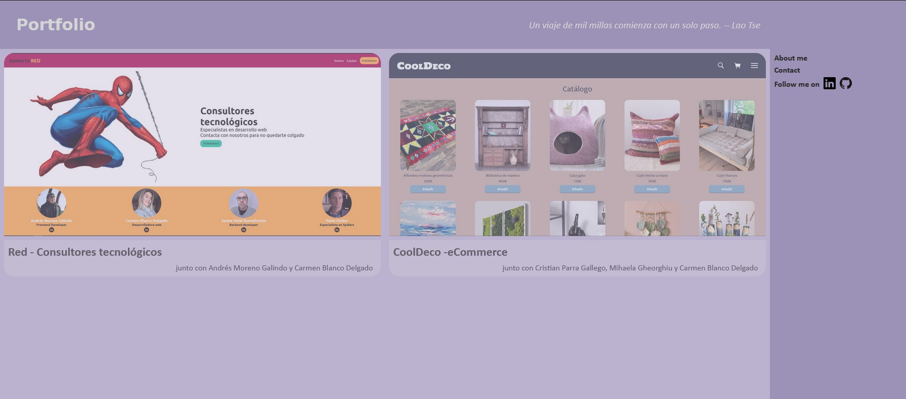
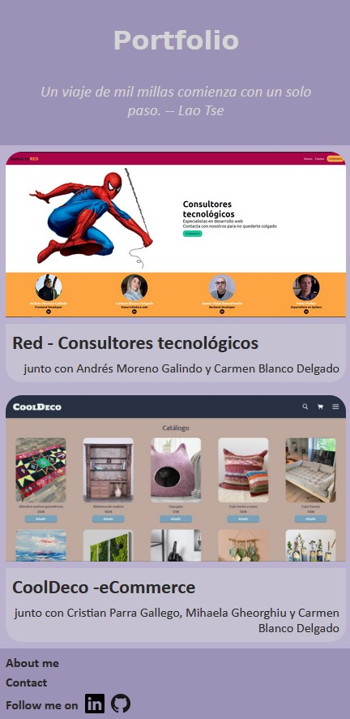
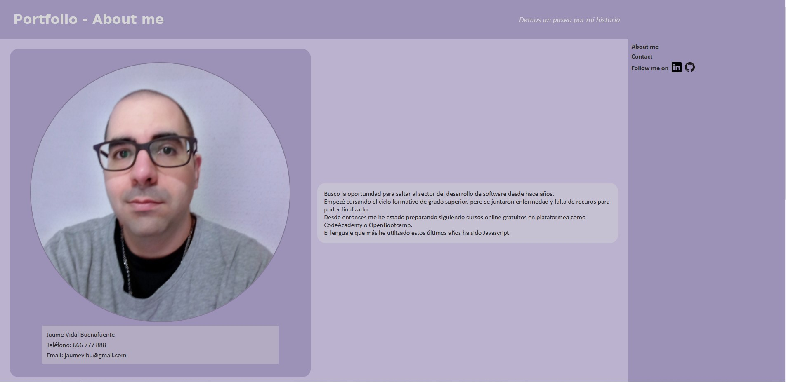

# Portfolio

## <a href="https://jaumevibu.github.io/portfolio/">Demo</a>

---

### <a href="https://www.figma.com/file/N8QpERnSGCHioak0mUujdu/sketches?node-id=0%3A1&t=uvAbvlMIjauI9oSb-1">Figma sketches & mockups</a>

---

#### Screenshots

Index - Desktop mode

Index - Mobile mode

About me - Desktop mode

About me - Mobile mode

---

## Objectives

- [x] Must be responsive
- [x] Must include CV
- [x] Readme must include screenshots
